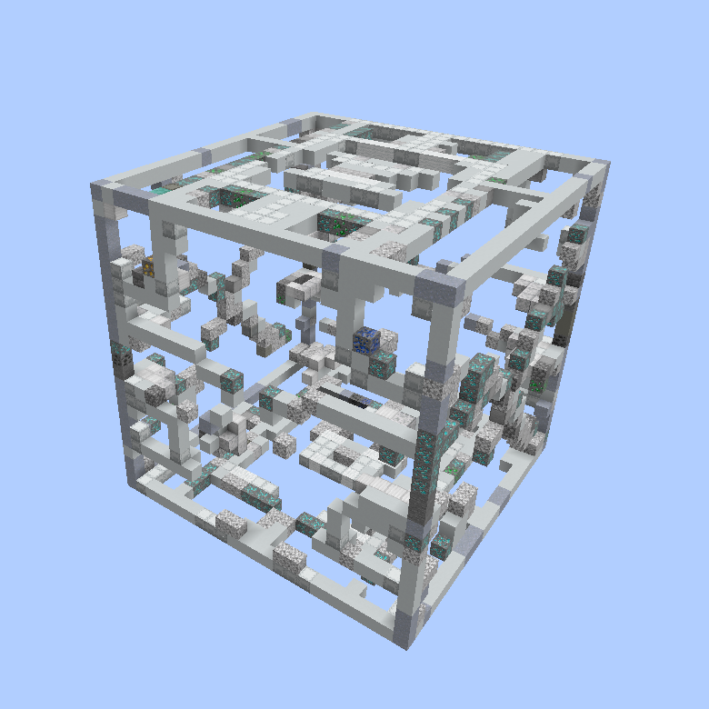
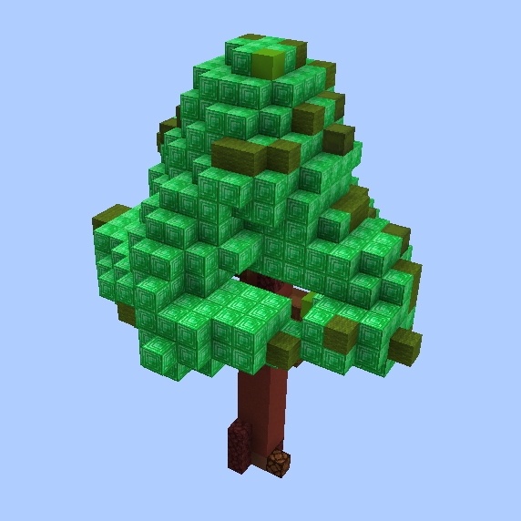
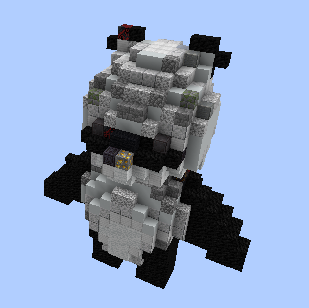
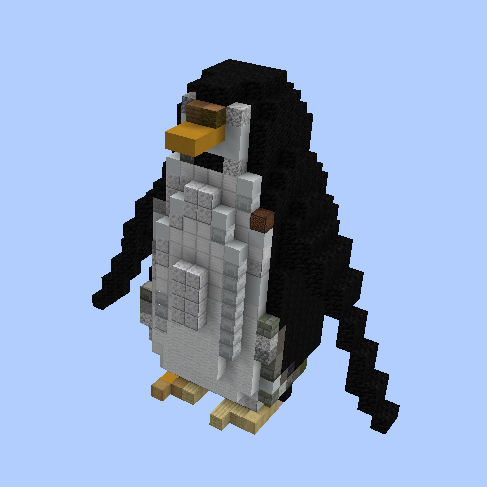
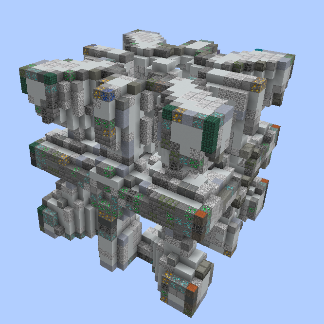
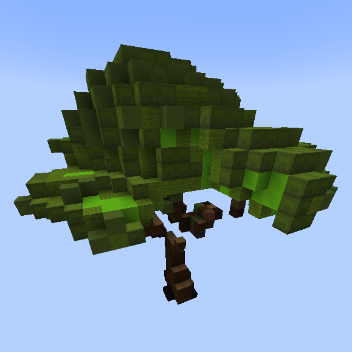

# Generating structures in the videogame "Minecraft" using the Shap-e model

This repository is for a research paper presented at the XXII "A Step Into Science" Students Conference at the Petnica Science Center in December 2023

 * See [Usage](#usage) for guidance on how to use this repository.
 * See [Examples](#examples) for examples of some generated structures.

# Abstract

A practical implementation of the Shap-e model was made as an integration into the computer game "Minecraft". The final results are generated structures based on a text prompt, with the aim of reducing the amount of time that professional teams of players spend on building projects in this computer game. The resulting STF was sampled to create the voxel mesh. After that, it was downsampled to remove anomalies and gaps. For all calculations and comparisons related to colors and textures, the CIE lab color space was used due to its better overlap with human color perception and linearity compared to the RGB color space. In order to create the color mapping to the blocks, the median cut algorithm was used to find the color that best represents the block. That color representation is used to calculate the Euclidean distance of the colors in the TF from the Shap-e object and the in-game blocks, thereby obtaining a matching color representation of the Shap-e generated in-game object using Minecraft blocks. The final result is satisfactory, taking into account the limitations of the Shap-e generative model, and the practical application of the Shap-e model is demonstrated.

# Paper

The full paper is written in Serbian and was presented at the XXII "A Step Into Science" Students Conference at the Petnica Science Center in December 2023

It was also presented at the IEEESTEC 16th Student Projects Conference in November 2023  and published in the proceedings of papers - p. 173-176 ISBN 978-86-6125-273-0.

[Link to paper](https://ieee.elfak.ni.ac.rs/wp-content/uploads/2023/11/2023.pdf#page=181)

# Examples

Here are some select examples generated by the program.

<table>
    <tbody>
        <tr>
            <td align="center">
                
            </td>
            <td align="center">
                
            </td align="center">
            <td align="center">
                
            </td>
        </tr>
        <tr>
            <td align="center">A hypercube</td>
            <td align="center">A lego tree</td>
            <td align="center">A panda</td>
        </tr>
        <tr>
            <td align="center">
                
            </td>
            <td align="center">
                
            </td>
            <td align="center">
                
            </td>
        </tr>
        <tr>
            <td align="center">A penguin</td>
            <td align="center">A thick hypercube</td>
            <td align="center">A voxelized oak tree 16x16</td>
        </tr>
    </tbody>
<table>

# Usage

Prerequisites:
 * Minecraft server that is set up for RCON.

Navigate to the [src](src/) directory and install with `pip install -e .`.

To get started with the program:

 * Use [generate_latents.ipynb](src/generate_latents.ipynb) to generate latents and export color and coordinate data.
 * Use [minecraft_inject.py](src/minecraft_inject.py) to inject the structure into your Minecraft server.

Note: You must change the predefined server password and port for RCON in [minecraft_inject.py](src/minecraft_inject.py).
